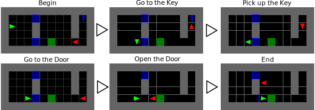

# AI Agency Hackaton (Sep 2023)



## Installation

We are using Python 3.10.

Configure submodules with:
```bash
git submodule update --init --recursive
```

Install dependencies with:
```bash
pip install -r requirements.txt
```

# How to run

To run the experiments on the environment with 2 agents and 1 door, 
you can use the `run_exp.sh` and specify the `<exp_id>` as:
- `0`: For reward `sparse`
- `1`: For reward `altruistic`
- `2`: For reward `neg_distance` 
```bash
./run_exp.sh <exp_id>
```

This will train an agent (without observing the goals)
for `1M` steps using `4` parallel environments,
and save the results in `logs/`.

**Note:** The script is subject to change as we add more experiments, so please check it before running.


# Known Issues
- Import Error when launching tensorboard
`ImportError while running tensorboard command: cannot import name '_plain_int' from 'werkzeug._internal'`
. 
Resolve by installing `werkzeug` with conda:
```bash
conda install -c conda-forge werkzeug
```

- Import Error when launching tensorboard 2:
`ImportError: cannot import name 'COMMON_SAFE_ASCII_CHARACTERS' from 'charset_normalizer.constant'`.
Resolved by installing `charset_normalizer` with conda:
```bash
conda install -c conda-forge charset-normalizer
```